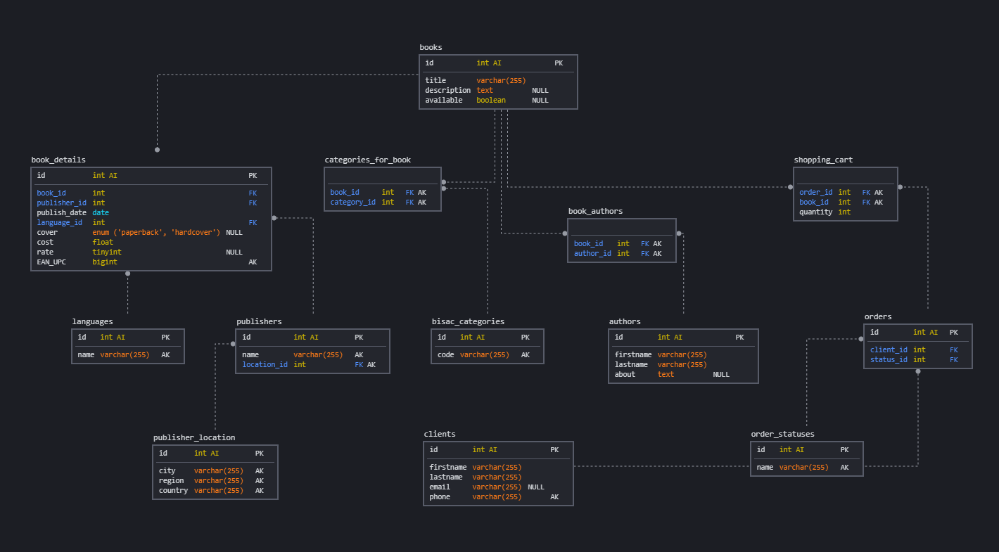

<h1>Проектирование базы данных для Книжного мазагина</h1>
<h2>Схема БД</h2>

<section>
    <table>
        <caption><h2>Таблицы и их описание<h2></caption>
        <tr>
            <td>Название таблицы</td>
            <td>Описание таблицы</td>
        </tr>
        <tr>
            <td>languages</td>
            <td>Названия языков</td>
        </tr>
        <tr>
            <td>publisher_location</td>
            <td>Информация о месте издательства</td>
        </tr>
        <tr>
            <td>publishers</td>
            <td>Информация о издательствах</td>
        </tr>
        <tr>
            <td>books</td>
            <td>Минимальная информация о книге (название, описание и наличие)</td>
        </tr>
        <tr>
            <td>book_details</td>
            <td>Подробная информация о книге (издательство, дата публикации EAN / UPC</td>
        </tr>
        <tr>
            <td>bisac_categories</td>
            <td>Коды BISAC категорий</td>
        </tr>
        <tr>
            <td>authors</td>
            <td>Информация об авторах</td>
        </tr>
        <tr>
            <td>categories_for_book</td>
            <td>BISAC категории для книги</td>
        </tr>
        <tr>
            <td>book_authors</td>
            <td>Авторы для книг</td>
        </tr>
        <tr>
            <td>clients</td>
            <td>Информация о клиентах</td>
        </tr>
        <tr>
            <td>orders</td>
            <td>Информация о заказах</td>
        </tr>
        <tr>
            <td>shopping_cart</td>
            <td>Информация о корзине заказа</td>
        </tr>
        <tr>
            <td>order_statuses</td>
            <td>Информация о статусах заказа</td>
        </tr>
    </table>
</section>

<section>
    <table>
        <caption><h2>Представления и их описания<h2></caption>
        <tr>
            <td>Название таблицы</td>
            <td>Описание таблицы</td>
        </tr>
        <tr>
            <td>publisher_info</td>
            <td>Список всех издательств с их местоположением</td>
        </tr>
        <tr>
            <td>bisac_codes</td>
            <td>Список всех BISAC кодов</td>
        </tr>
        <tr>
            <td>book_info</td>
            <td>Список всех книг со всей информацией</td>
        </tr>
        <tr>
            <td>books_by_bisac</td>
            <td>Список книг сгруппированных по BISAC категориям</td>
        </tr>
    </table>
</section>